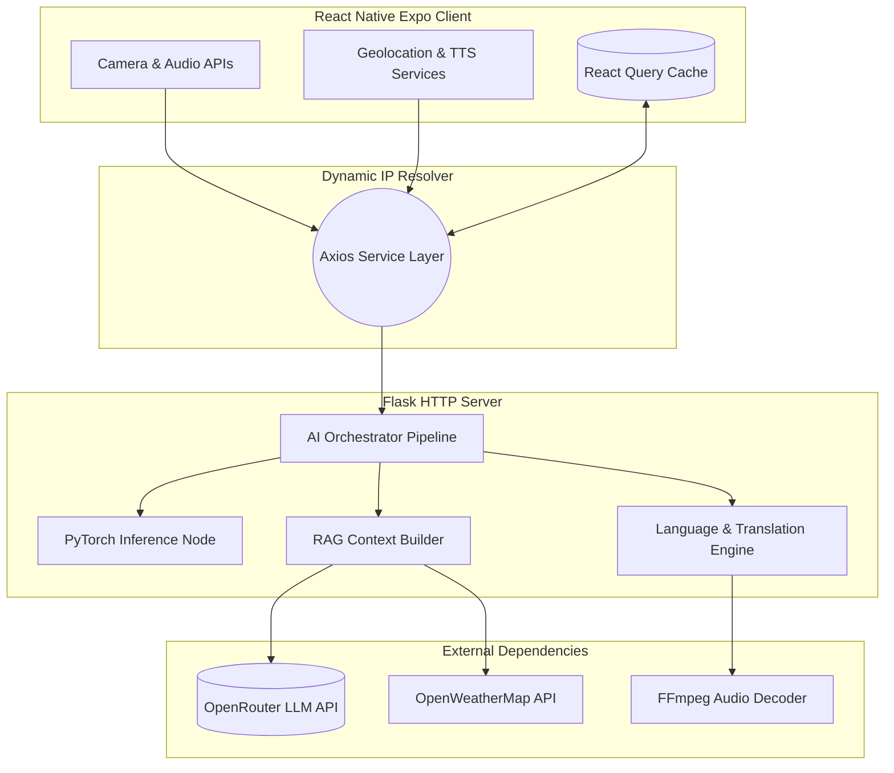

<div align="center">
  
  <br/>
  <h2>Intelligent Crop Protection & Farm Management System</h2>
  <b style="color: #666;">A comprehensive, enterprise-grade AI solution engineered to empower the modern agricultural ecosystem through real-time predictive modeling, location-aware intelligence, and multilingual cognitive services.</b>
  <br/><br/>
  
  
  
  
  
</div>

---

## 📖 Executive Summary

The **Kisan AI Shield** is a production-ready mobile application that merges cutting-edge **Computer Vision**, **Large Language Models (LLMs)**, and **Geospatial APIs** into a seamless, offline-tolerant interface. Designed specifically for the unstructured challenges of agriculture, the system provides high-reliability crop disease classification, context-aware RAG (Retrieval-Augmented Generation) advisory, dynamic market forecasting, and hyper-local meteorological tracking. 

The platform features a highly optimized modular architecture, enabling rapid iteration of machine learning models on the backend without requiring frontend deployments, while utilizing `@tanstack/react-query` to achieve zero-latency state caching on the client.

---

## 🚀 Core Platform Capabilities

### 1. Advanced Computer Vision Diagnostics (`DiseaseScreen`)
A robust image-processing pipeline that ingests raw camera streams and translates them into actionable agronomic insights.
- **Model Architecture:** Custom PyTorch CNN (Convolutional Neural Network) utilizing Transfer Learning for high-accuracy feature extraction.
- **Inference Pipeline:** Automatically standardizes input dimensions directly in the backend, removing heavy preprocessing duties from the mobile client.
- **Output Metrics:** Returns deterministic classifications paired with floating-point confidence thresholds for clinical evaluation.

### 2. Conversational RAG Advisory System (`AIScreen`)
An interactive LLM-driven engine utilizing `stepfun/step-3.5-flash:free` via the OpenRouter API.
- **Multimodal Audio Engine:** Seamlessly ingests native `.m4a` mobile audio, transpiles it server-side using `pydub`/FFmpeg, and executes highly accurate speech-to-text recognition.
- **Text-to-Speech (TTS):** Automatically synthesizes the AI's response text into natural language audio playback on the mobile device.
- **Dynamic Context Injection:** Transparently intercepts user prompts to inject background meteorological data and geographical coordinates, grounding the LLM's agronomical advice in reality.

### 3. Cross-Boundary Localization 
A dynamic i18n localization engine operating synergistically across both the client and the backend.
- **Languages Supported:** English (🇬🇧), Hindi (🇮🇳), Telugu (🇮🇳).
- **Backend Translation Matrix:** Uses sophisticated prompt engineering to force the LLM to process complex English context but return fully localized dialect responses.

### 4. Deterministic State Caching (`WeatherScreen`, `SchemesScreen`, `MarketScreen`)
- **React Query:** Engineered with robust `@tanstack` hydration techniques to eliminate network delays between tabs. Background polling ensures crop market prices and 5-day weather vectors are always fresh without locking the main UI thread.
- **Two-Phase Rendering:** Leverages instantaneous hardcoded fallback models while negotiating asynchronous analytical requests in the background.

---

## 🏗️ System Architecture & Technology Stack



---

## 🛠️ Deployment & Installation Strategy

### Prerequisites
- **Node.js (v18+)** for the Expo bundler
- **Python (3.11+)** for the ML pipeline
- **FFmpeg executable** added to the OS PATH (Essential for Mobile `.m4a` stream decoding)
- **NVIDIA GPU (CUDA)** highly recommended for optimal PyTorch and HuggingFace execution speeds

### 1. Sourcing API Keys
Create a `.env` file sequentially at the root of the project to authenticate the cognitive and meteorological external services:
```env
AI_API_KEY=your_openrouter_api_key
EXPO_PUBLIC_WEATHER_KEY=your_openweathermap_api_key
```

### 2. Initializing the Python Backend Service
```bash
# Navigate to the backend service folder
cd ai-backend

# Instantiate and activate the isolated virtual environment
python -m venv ai_env
ai_env\Scripts\activate       # Windows System
# source ai_env/bin/activate  # UNIX System

# Resolve all pip dependencies including PyTorch and Flask
pip install flask flask-cors torch torchvision python-dotenv requests openai pydub SpeechRecognition

# Boot the API Gateway
python app.py
```

### 3. Launching the React Native Client
```bash
# Ensure you are operating within the root kisan-ai-shield/ workspace
npm install

# Initialize the Expo Dev Server with local Wi-Fi pairing
npx expo start -c
```
*Note: The frontend architecture natively features the `apiConfig.js` service layer, designed to dynamically hunt for the host's Expo LAN IP endpoint. Manual cross-compilation of internal static IP routes is entirely deprecated in v2.0.*

---

## 🗄️ Application File Tree Overview

```text
kisan-ai-shield/
├── ai-backend/                  # Secure ML Environment Segment
│   ├── app.py                   # Primary WSGI REST API Gateway
│   ├── ai_pipeline.py           # Facade orchestrating Model inference
│   ├── features/                # Domain-Driven Microservice Modules
│   │   ├── disease_vision_engine.py  # Computer Vision Service
│   │   ├── advisory_llm_engine.py    # Generative RAG Service
│   │   ├── speech_to_text.py         # FFMPEG Audio Subsystem
│   │   └── gov_schemes.py            # JSON Semantic Parser
├── screens/                     # View-Layer Component Renderers
│   ├── AIScreen.js              # State-managed Audio Chat Interface
│   ├── DiseaseScreen.js         # Camera & Device Storage Handlers
│   ├── WeatherScreen.js         # D3/Animated Vector Graph Views
│   ├── SchemesScreen.js         # Reactive Multi-Step Form Contexts
├── services/                    # Asynchronous Transport Controllers
│   ├── apiConfig.js             # DHCP Intranet IP Hunting Loop
│   ├── aiService.js             # Blob/FormData Network Proxies
├── constants/                   # Immutables & Tokenization Logic
└── app/(tabs)/_layout.tsx       # Expo Router Deep Link Configurations
```

---
<br/>
<p align="center">
  <b>Architected for Enterprise Scale. Engineered for the Farmer.</b><br/>
  <i>Part of the Saagu360 Agricultural AI Initiative</i>
</p>
